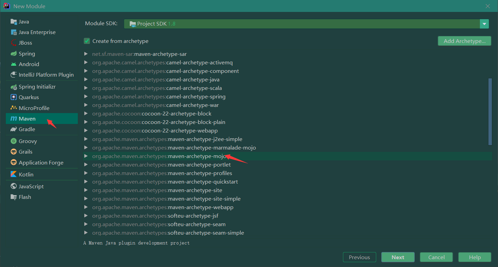
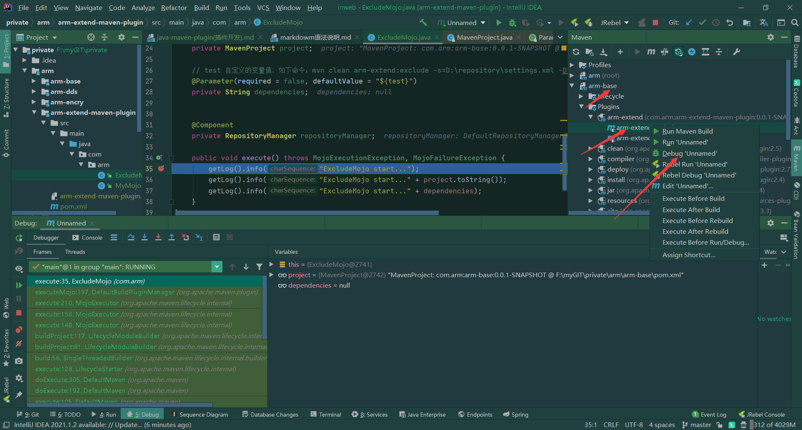

### Ⅰ：准备 https://www.cnblogs.com/kiwifly/archive/2020/03/31/12602407.html

+ 1.使用idea作为开发工具
+ 2.创建module
  
+ 3.创建module时文件命令规则为 xx-maven-plugin。官方命名规则（maven-xx-plugin）,不要使用的官方的命令规则。
+ 4.生成好的项目默认引用了（maven-plugin-api），但是实际开发远远不够。所以要根据实际要开发的功能导入对应的maven包。 pom文件的 `<packaging>maven-plugin</packaging>`
  为这个，注意一下
+ 5.注意事项：创建时如果一直卡住，请找梯子。

### Ⅱ：开发

##### 一：概念

+ 1
```
  1.maven插件:在pom文件中的packaging指定为maven-plugin，即该项目就是一个maven插件。一个maven插件项目可以有多个执行目标. 
  2.目标执行:  插件名:目标 （arm-extend:exclude） 
```

+ 2 注解
```
1.@Mojo（org.apache.maven.plugins.annotations.Mojo） 将该类标记为一个maven插件中的一个执行目标
    name ： maven插件执行目标名称。
    defaultPhase ：默认在那个生命周期节点执行。可以在pom文件中plugin标签中指定。指定优先级高一些。
    threadSafe ：是否线程安全。
    ...
    
2.@Parameter 
    defaultValue ： 默认值，支持变量表达式，从maven上下文中获取变量值。（重要）
    readonly : 是否只读
    required ： 是否必须有值

```  

+ 3 变量：${?} 使用${}获取maven运行时变量值。其中有maven定义的变量值，也有用户可使用的定义变量值

```
// project maven 定义的变量值
@Parameter(defaultValue = "${project}", readonly = true)
private MavenProject project;


// test 自定义的变量值，如下命令：mvn clean arm-extend:exclude -s=D:\repository\settings.xml -Dtest=aaa
// dependencies的值为命令中传入的test值：aaa
@Parameter(required = true, defaultValue = "${test}")
private String dependencies;
```

+ 4 maven系统变量值整理：

```
1. project  org.apache.maven.project.MavenProject
2. session  org.apache.maven.execution.MavenSession
3. mojoExecution org.apache.maven.plugin.MojoExecution
4. plugin org.apache.maven.plugin.descriptor.PluginDescriptor
5. settings org.apache.maven.plugin.MojoExecution

```

##### 二：开发

+ 1.AbstractMojo：这是maven插件开发比较重要的概念，插件的执行入口就是继承改类的子类。
  `public class ExcludeMojo extends AbstractMojo`
+ 2.@org.apache.maven.plugins.annotations.Parameter
    + 1 defaultValue:读取变量参数
    + 2 required:是否必须
    + 3 readonly：是否只读

### Ⅲ：启动

+ 1.如何debug:首先clean install你的插件，然后在你引用插件的项目中右键选择debug就可以了。
  
+ 2.如何再项目中一起调试官方插件和你的插件

```
 1.首先再pom文件中引用你要调试的官方pom文件
    <dependency>
        <groupId>org.apache.maven.plugins</groupId>
        <artifactId>maven-war-plugin</artifactId>
        <version>2.2</version>
    </dependency>
 2. 然后再再maven中选中你要调试lificycle中的节点，右键debug就可以了。

```

### Ⅳ：命令

+ 1.maven命令执行参数：https://www.cnblogs.com/zhaoyan001/p/8735196.html
+ 2.命令执行指定setting文件 ：

### Ⅴ：功能开发

+ 1.场景：因为公文项目的原因，视图层分为了多个包，但是每个包的映射地址是一样的，一个war只能引用一个jar包，这就造成了发包时要确定
  到底项目上需要引用哪一个包版本和再git上创建了多个web和dubbo的分支，每次修改配置后就需要修改多个包配置，十分繁琐。
  所以这边做个插件，直接引用所有包，通过命令去动态的确定需要引用那个jar。这样就不会有多个web和dubbo工程了。

+ 2.开发，下载package的打包war插件，跟踪源码发现打包时的WEB\lib下的文件生成来源于： context.getProject().getArtifacts()。
  context的project对象通过parameter设置。

+ 4.mvn clean arm-extend:exclude -s=D:\repository\settings.xml -Dexclude=arm-encry,arm-java

**重点**

```
一：@Mojo(name = "exclude", defaultPhase = LifecyclePhase.PACKAGE, threadSafe = true,
            requiresDependencyCollection = ResolutionScope.COMPILE_PLUS_RUNTIME
    )
    1.配置defaultPhase就不要再pom文件中指定<phase>？</phase>的配置，不然会以pom文件中指定的为准执行。
    2.requiresDependencyCollection必须要配置，不然context.getProject().getArtifacts()无法获取到值。

二：经过测试发现，每一个步骤的插件执行都是重新开始执行的，所以不同插件即使是再同一个生命周期中其上下文数据也不通用兼容。
   要完成上述功能，只有通过修改pom文件实现。所以要排除通过循环依赖进来的jar还有待研究。
    
三：maven传入自定义参数有两种方式
    第一：命名方式 -D : package -Dexclude=arm-encry,arm-java -Dforce=false -e -f pom.xml
    第二：pom指定：
         <properties>
            <force>false</force>
         </properties>
        
四        
```
