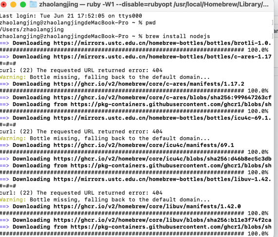

# 安装

## 方式一

+ 第一步：brew install nodejs
  

## 方式二

+ 下载安装包： https://nodejs.org/zh-cn/download/
+ 安装成功

```
This package has installed:
	•	Node.js v16.16.0 to /usr/local/bin/node
	•	npm v8.11.0 to /usr/local/bin/npm
Make sure that /usr/local/bin is in your $PATH.
```

+ 使用 node -v ; npm -v 查询安装情况

# idea跑项目问题
+ 1.找不到某些lib：Error: Cannot find module 'antd-theme-generator'
```
// 使用sudo安装，不然没权限 。 --global  全局配置，蒋裤安装到npm的全局仓库中
sudo npm install --global  antd-theme-generator
```
