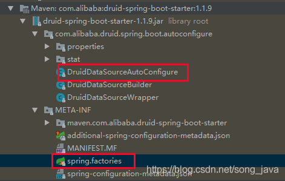

# boot基本介绍

## 1.gitHub boot project 介绍

```
├── spring-boot-project   （parent项目）  
│   ├── spring-boot     boot提供的主要功能 
│   ├── spring-boot-actuator    boot的管理功能核心，对应用程序的监控和管理，默认只开启，
    ├──     默认只暴露了部分节点（health和info），其他的需要在配置文件中配置 see: https://blog.csdn.net/u010994966/article/details/83061408
│   ├── spring-boot-actuator-autoconfigure    boot的管理功能的自动装配，和boot结合  see: https://www.choupangxia.com/2019/11/19/spring-boot-actuator/
│   ├── spring-boot-autoconfigure    自动装配 
│   ├── spring-boot-cli     spring 命令工具 
│   ├── spring-boot-dependencies     gradle依赖模块
│   ├── spring-boot-devtools     热部署工具模块
│   ├── spring-boot-docs     文档模块  
│   ├── spring-boot-properties-migrator     配置映射转换模块
│   ├── spring-boot-starters    各种start模块的集成包 参见：https://www.cnblogs.com/yaowen/p/8623902.html
│   ├── spring-boot-test    -- 
│   ├── spring-boot-test-autoconfigure     --
│   ├── spring-boot-tools    --
```

## 2.spring-boot

## 3.spring-boot-actuator

+ application.yml简单配置：

```
management:
  endpoint:
    health:
      enabled: true  # 开启健康管理
      show-details: always # 总是显示详细信息
  endpoints:
    web:
      exposure:
        include: "*" # 开启所有web访问   exclude 是排除，注意下别写反了
```

## 4.spring-boot-autoconfigure 自动装配

### 原理 
> 使用 SpringBootApplication 注解标记一个应用，**EnableAutoConfiguration** 注解就是主要用于导入加载组件用的。  
> EnableAutoConfiguration中的@Import({AutoConfigurationImportSelector.class})这个是重点 。  
> AutoConfigurationImportSelector 组件用于匹配筛选需要加载的组件。spring.factories 被加载过程：  
> getAutoConfigurationEntry() -> getCandidateConfigurations() -> SpringFactoriesLoader.loadFactoryNames()

#### AutoConfigure 装配原理

> 使用 spring.factories 配置文件加载，在创建boot-start项目时，创建该文件，在文件标记需要自动装配的类。
> 相当于标记一个功能注册的启动类位置。

+ 列子：

durid数据库连接池,durid也专门提供了自动配置支持

**spring.factories**中的内容是这样的:
> org.springframework.boot.autoconfigure.EnableAutoConfiguration=\
com.alibaba.druid.spring.boot.autoconfigure.DruidDataSourceAutoConfigure

**DruidDataSourceAutoConfigure.java** 中的内容：


## 5.spring-cli

### 简介

> Spring Boot CLI (Command Line Interface)是一个命令行工具，可以快速搭建spring原型项目。可以使用Groovy脚本，脚本比较和java语法类似，
> 非常简洁

## 6.spring-boot-devtools 热部署工具类

### 原理

> 参考：https://blog.csdn.net/cxlswh/article/details/113926878
> 其原理是使用监听程序监听重启事件，监听程序在调用重启类进行重启。
> 具体可以看类：
> META-INF 下的 spring.factories LocalDevToolsAutoConfiguration
> org.springframework.boot.devtools.restart.RestartApplicationListener
> org.springframework.boot.devtools.restart.Restarter
> org.springframework.boot.devtools.restart.RestartLauncher
>
> **监听过程:**  
> 1.FileSystemWatcher 类进行文件监听，具体查看 FileSystemWatcher.Watcher.scan()方法。原理是将比较一定时间内的前一个快照和当前
> 快照的不同，如果不同就重启。
>
> 2.**RestartApplicationListener**监听**ApplicationEvent**事件，当监听到重启事件（**ApplicationStartingEvent**）时，
> 将调用Restarter.initialize()方法重启应用。
> 
> 3.继续调用start()方法，doStart()装载需要热部署的类和类加载器；relaunch(ClassLoader classLoader)方法执行重启应用方法。
>
> **过程分析:**  
> 技巧1：热部署时将不会重新加载lib下的三方包，可参考 **DefaultSourceDirectoryUrlFilter**的策略机制：COMMON_ENDINGS = { "/target/classes", "/bin" };  
> 技巧2：通过 RestartLauncher.run() Method mainMethod = mainClass.getDeclaredMethod("main", String[].class); mainMethod.invoke(null, new Object[] { this.args }); 重启应用。  
> 技巧3：通过 Restarter.immediateRestart() SilentExitExceptionHandler.exitCurrentThread(); main主线程抛出该异常，结束main线程。


## 7.spring-boot-starters
