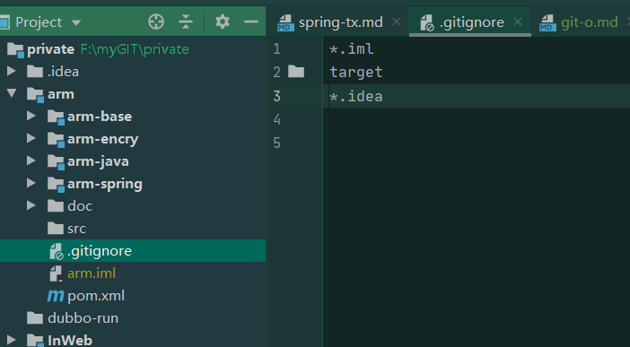

# git操作文档
### idea新建git并push到git
+ 1.创建maven项目。
+ 2.选中目录并选中vcs -> lmport into Version Control -> Create Git Repository。

+ 3.创建一个忽略文件用来添加需要被忽略文件。

+ 4.选择提交项目 vcs -> commit。
+ 6.在git上面创建一个repositories。注意是repositories不是project。
+ 7.选择push项目到git，vcs -> push。注意这里使用git协议，别用http，可能遇到未知错误😂。

  
+ 8.文件大

### 错误1： Failed to connect to github.com port 443: Operation timed out
> 描述：idea clone,pull代码一直报错,没发成功，报上述错误 。 
> 处理办法：首先的访问github需要梯子，在梯子的情况下还出现上诉错误。找到socket代码端口，命令行输入如下两行代码：
> git config --global http.proxy http://127.0.0.1:7890
> git config --global https.proxy https://127.0.0.1:7890
> 使用命令：cat ~/.gitconfig   查看。